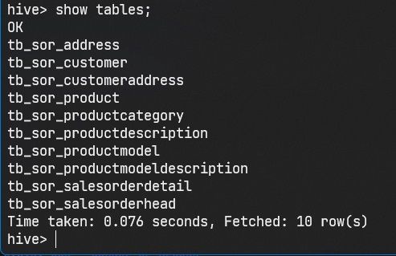
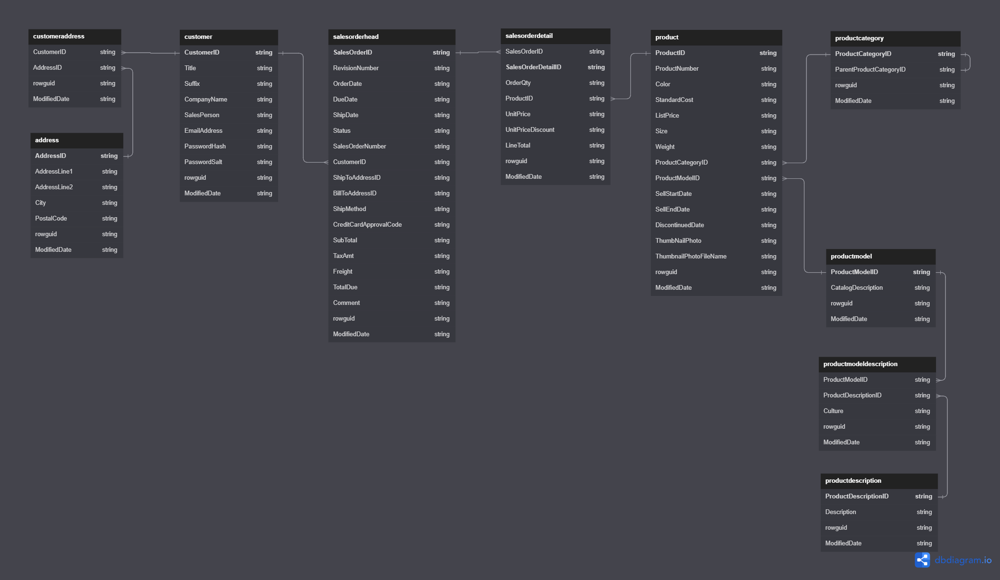
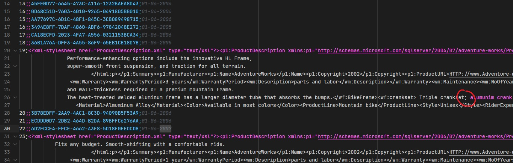
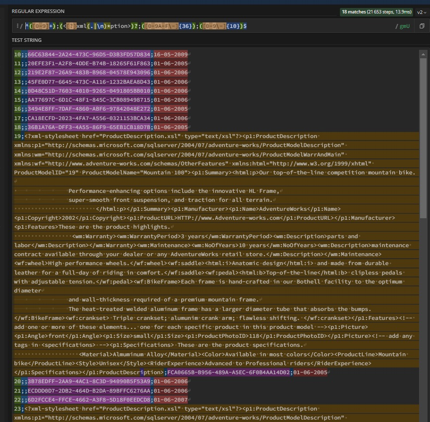

# BIGDATA DOCKER MBA HIVE

## OBJETIVO 
Este repositório tem como objetivo exercitar atividades relacionadas à aula sobre Hive realizada em sala de aula durante o MBA de Engenharia de Dados, disciplina Distributed Data Processing & Storage na FIAP em 2023.

## PROPOSTA
A ideia desta atividade é dividida em duas partes:
  ### Primeira parte:
  * Carregar os arquivos que foram disponibilizados pelo professor em sala de aula (```/files/hadoop/*.csv```) no HDFS;
  * Criar um database no HIVE com o nome AdventureWorks;
  * Consultar dados sobre Pessoas e “serviços” consumidos;
  * Criar uma tabela com a visão dos tipos de *Serviço*/ *Aventura* contratados agregados;
  * Criar uma tabela com dados para segmentação e análise dos clientes;
  
  ### Segunda parte:
  * Modelar uma flattened table com os *KPIs* que nosso grupo decidiu como essenciais para monitoramento do negócio, pensando no ponto de vista de venda/contratação.

## EXECUÇÃO (Como rodar a proposta)

Antes de tudo, você precisa ter o [Docker Desktop](https://www.docker.com/products/docker-desktop/) instalado e inicializado.

Para iniciar o ambiente *Hadoop + Hive* em Docker execute o comando abaixo, de preferência em um terminal shell:

```shell
docker compose up -d
```

O processo seguinte é divido em 4 scripts para facilitar o entendimento e execução em etapas:
```shell
0-setup.sh  # prepara ambiente (reset)
1-sor.sh    # carrega dados crus (as-is)
2-sot.sh    # faz tratamentos e agregações
3-spec.sh   # carrega visões especializadas
```

### 0 - SETUP / RESET DO AMBIENTE
O script abaixo serve para criar a estrutura de diretórios no HDFS, copiar os arquivos e criar database no Hive:

```shell
. ./0-setup.sh
```
Para dar um reset no ambiente (arquivos e database), basta executar esse script novamente.

__Atenção__, este script apaga o database e recria do zero!

### 1 - CAMADA SOR - SOURCE OF RECORD

Em seguida criamos um script para criar as tabelas de dados crus no Hive:
```shell
. ./1-sor.sh
```
No fim, devemos ter todas as tabelas carregadas no Hive:



Problemas encontrados:
  1. Cada arquivo representava uma entidade no diagrama que foi fornecido porém o modelo estava complexo e não refletia 100% as entidades.
  Para resolver este problema, criamos um novo diagrama mais simplificado que nos ajudou a ter mais clareza da estrutura dos dados. Você pode acessá-lo
  [aqui](https://dbdiagram.io/d/64582ec1dca9fb07c4a90b21).
  
  2. Os arquivos são CSV com colunas separadas por *ponto e vírgula (;)*, porém alguns arquivos apresentaram problemas como por exemplo *productmodel.csv*, que na coluna *CatalogDescription* possui um texto xml com quebras de linha e *ponto e vírgula (;)* no meio do texto:
  
   Para tentar resolver este problema, criamos uma *Regular Expression* que identifica o padrão do texto, porém não conseguimos aplicar na criação da tabela no Hive:
   
   Em uma aplicação no mundo real, talvez criaríamos um processo de limpeza dos dados antes de chegar no data lake. Como esta coluna não afeta nosso estudo, fizemos uma importação simples.
 
### 2 - CAMADA SOT - SOURCE OF TRUTH

Na próxima etapa, criamos algumas *flattened tables* (vulgo *tabelão*) para organizar as dimensões baseadas nos clientes, serviços e vendas. Execute o script abaixo para criar as tabelas:
```shell
. ./2-sot.sh
```

TODO:
 * Criar uma tabela com a visão dos tipos de *Serviço*/ *Aventura* contratados agregados;
 * Criar uma tabela com dados para segmentação e analise dos clientes
 * Segregação dos dados
    
### 2 - CAMADA SPEC - VISÕES ESPECIALIZADAS

E finalizando, o último script cria algumas visões relacionadas ao que foi proposto e o que achamos interessante durante a avaliação dos dados:
```shell
. ./3-spec.sh
```

  * Uma tabela com a visão dos tipos de serviço/Aventura contratados agregados.
  * Uma tabela com dados para segmentação e analíse dos clientes.
  
Evidência da consulta relacionando pessoas com os serviços consumidos:


